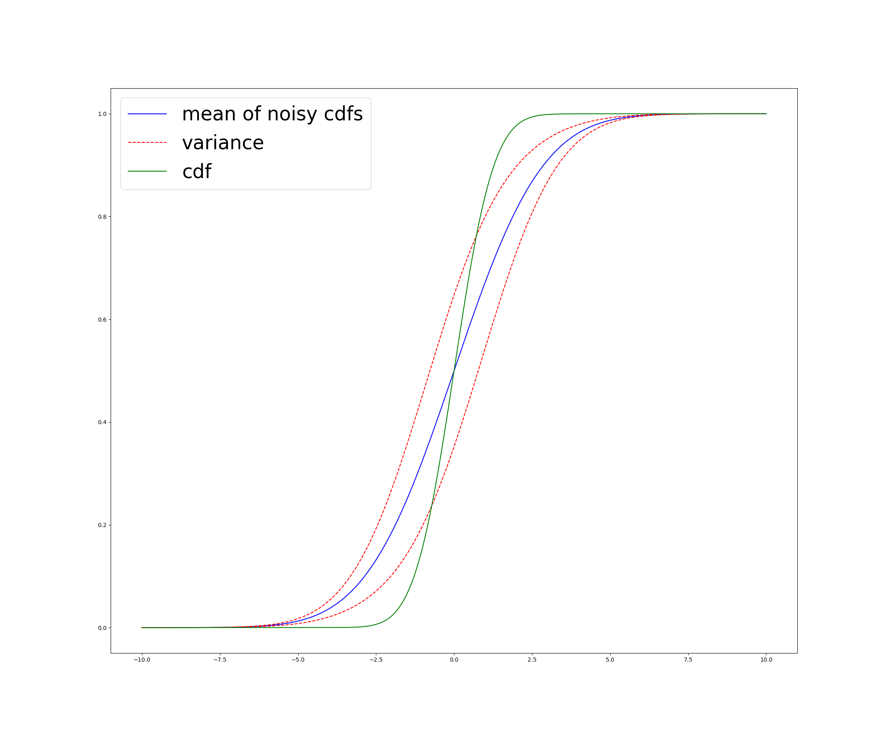

# CDFIntegrals

[](https://github.com/ngiann/CDFIntegrals.jl/actions/workflows/CI.yml?query=branch%3Amain)

Following equations taken from [List of integrals of Gaussian functions.](https://en.wikipedia.org/wiki/List_of_integrals_of_Gaussian_functions)

### Expectation
Function `M(μ, σ)` returns  expectation ∫ N(x|μ, σ) Φ(x) dx where Φ(x) is the standard cumulative normal.

### Variance
Function `V(μ, σ)` returns variance ∫ N(x| μ, σ) ⋅ (Φ(x) - M(μ, σ))² dx.

### Expectation of square
Function `B(μ, σ)` returns expectation of square ∫ N(x|μ, σ) [Φ(x)]² dx.

### Example

```
using CDFIntegrals
using PyPlot # must be indepedently installed

μ, σ = 1, 2
x = -10:0.01:10
plot(x, M.(x,σ),"blue",label="mean of noisy cdfs")
plot(x, M.(x,σ) .+ V.(x,σ),"--r",label="variance")
plot(x, M.(x,σ) .- V.(x,σ),"--r")
plot(x, CDFIntegrals.Φ.(x),"g",label="cdf")

legend()
```

